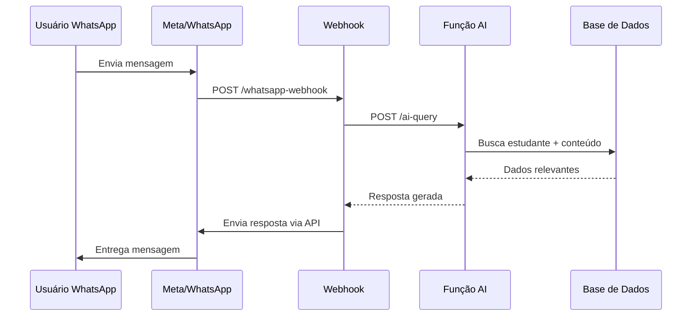

# 📱 Integração WhatsApp - Guia Completo

## 🎯 Visão Geral

O **Clever School Pal AI** possui integração completa com WhatsApp Business API (oficial do Meta), permitindo que estudantes interajam com o assistente educacional diretamente pelo WhatsApp.

**IMPORTANTE**: O sistema **NÃO** usa Baileys. Utiliza a WhatsApp Business Cloud API oficial, que é mais estável e profissional.

## 🏗️ Arquitetura Atual

### 1. **Webhook WhatsApp** (`supabase/functions/whatsapp-webhook/index.ts`)

- ✅ Recebe mensagens do WhatsApp via webhook oficial
- ✅ Processa mensagens de texto e imagens
- ✅ Identifica estudantes pelo número de telefone
- ✅ Chama função AI para gerar respostas personalizadas
- ✅ Envia respostas de volta via WhatsApp API

### 2. **Função AI** (`supabase/functions/ai-query/index.ts`)

- ✅ Identifica aluno por `whatsapp_number` ou `phone_number`
- ✅ Busca conteúdo educacional relevante na base de dados
- ✅ Gera resposta inteligente via OpenRouter
- ✅ Suporta geração de imagens educativas
- ✅ Mantém contexto das conversas

### 3. **Base de Dados**

- ✅ Tabela `students` com campos `phone_number` e `whatsapp_number`
- ✅ Campo `bot_active` para ativar/desativar bot por aluno
- ✅ Tabela `chat_logs` para histórico de conversas
- ✅ Sistema de cache para respostas rápidas

## 🚀 Funcionalidades Implementadas

### ✅ **Já Funcionando**

- 📱 Recebimento de mensagens de texto
- 🖼️ Recebimento e processamento de imagens
- 🎯 Identificação automática de estudantes
- 🧠 Respostas inteligentes personalizadas por turma/ano
- 📚 Busca em conteúdo educacional específico
- 💾 Cache de respostas para velocidade
- 📊 Logging completo de interações
- 🎨 Geração de imagens educativas (placeholder)

### 💬 **Tipos de Mensagem Suportados**

- **Texto**: Perguntas sobre matérias, dúvidas, etc.
- **Imagem**: Fotos de exercícios, diagramas, etc.
- **Resposta**: Texto e imagens de volta

## ⚙️ Configuração Necessária

### 1. **Variáveis de Ambiente**

Adicione ao seu `.env`:

```env
# WhatsApp Business API Configuration
WHATSAPP_ACCESS_TOKEN=your_whatsapp_access_token
WHATSAPP_PHONE_NUMBER_ID=your_phone_number_id
WHATSAPP_TOKEN=your_webhook_verify_token

# AI Configuration (OpenRouter)
OPENROUTER_API_KEY=your_openrouter_api_key
OPENROUTER_BASE_URL=https://openrouter.ai/api/v1
AI_MODEL=meta-llama/llama-3.1-70b-instruct
MEDIA_AI_MODEL=meta-llama/llama-3.1-70b-instruct
```

### 2. **Meta Developers Console**

#### **Passo 1: Criar App Business**

1. Acesse [developers.facebook.com](https://developers.facebook.com)
2. Clique em "Create App" → "Business"
3. Nome: "Clever School Pal AI"
4. Email de contato da empresa

#### **Passo 2: Adicionar WhatsApp Business**

1. No dashboard da app, clique "Add Product"
2. Encontre "WhatsApp Business" → "Set up"
3. Selecione "Business Account" apropriada

#### **Passo 3: Configurar Webhook**

1. Na seção "WhatsApp" → "Configuration"
2. URL do Webhook: `https://seu-projeto.supabase.co/functions/v1/whatsapp-webhook`
3. Verify Token: defina um token secreto (ex: `clever_school_2024`)
4. Campos: selecione `messages`
5. Clique "Verify and Save"

#### **Passo 4: Obter Credenciais**

1. **Access Token**: Na seção "WhatsApp" → "API Setup"
2. **Phone Number ID**: Na lista de números de telefone
3. **Webhook Token**: O que você definiu no passo 3

### 3. **Configurar Estudantes**

Execute o script para configurar WhatsApp dos estudantes:

```bash
node setup-whatsapp-students.js
```

Este script:

- Copia `phone_number` para `whatsapp_number` se vazio
- Ativa `bot_active = true` para todos os estudantes
- Mostra lista final de estudantes configurados

## 🔄 Fluxo Completo



## 🧪 Como Testar

### 1. **Teste Básico**

```bash
node test-whatsapp-integration.js
```

### 2. **Teste Manual**

1. Configure um número de teste no Meta Developers
2. Adicione o número como estudante na base de dados:

```sql
INSERT INTO students (name, whatsapp_number, class_id, school_id, bot_active)
VALUES ('Teste WhatsApp', '+351999999999', 'class_id_aqui', 'school_id_aqui', true);
```

3. Envie mensagem WhatsApp para o número configurado
4. Verifique logs no Supabase Functions

## 📊 Monitoramento

### **Logs da Função AI**

```bash
# Ver logs em tempo real
supabase functions logs ai-query --follow

# Ver logs do webhook
supabase functions logs whatsapp-webhook --follow
```

### **Verificar Interações**

```sql
-- Ver últimas conversas
SELECT
  s.name,
  c.question,
  c.answer,
  c.created_at
FROM chat_logs c
JOIN students s ON c.student_id = s.id
ORDER BY c.created_at DESC
LIMIT 10;
```

## 🚨 Resolução de Problemas

### **Webhook não recebe mensagens**

1. ✅ Verificar URL do webhook no Meta Developers
2. ✅ Confirmar que função está deployada: `supabase functions list`
3. ✅ Verificar logs: `supabase functions logs whatsapp-webhook`

### **Estudante não encontrado**

1. ✅ Verificar se `whatsapp_number` está correto na base de dados
2. ✅ Confirmar que `bot_active = true`
3. ✅ Executar: `node setup-whatsapp-students.js`

### **AI não responde**

1. ✅ Verificar se `OPENROUTER_API_KEY` e `OPENROUTER_BASE_URL` estão configuradas
2. ✅ Confirmar que há conteúdo educacional na base de dados
3. ✅ Ver logs da função AI

## 🔐 Segurança

### **Validação de Webhook**

- ✅ Verificação de token implementada
- ✅ CORS configurado apropriadamente
- ✅ Rate limiting via Supabase

### **Dados dos Estudantes**

- ✅ RLS (Row Level Security) nas tabelas
- ✅ Apenas estudantes ativos podem usar o bot
- ✅ Logs de todas as interações

## 🚀 Deploy

### **Desenvolvimento**

```bash
# Deploy funções
supabase functions deploy whatsapp-webhook
supabase functions deploy ai-query

# Configurar variáveis
supabase secrets set WHATSAPP_ACCESS_TOKEN=your_token
supabase secrets set WHATSAPP_PHONE_NUMBER_ID=your_id
```

### **Produção**

1. ✅ App Business verificada no Meta
2. ✅ Número de telefone verificado
3. ✅ Webhook em HTTPS (Supabase Edge Functions)
4. ✅ Monitoramento configurado

## 📈 Próximas Melhorias

### **Recursos Avançados**

- [ ] Botões interativos
- [ ] Menus de lista
- [ ] Templates de mensagem
- [ ] Mídia rica (áudio, vídeo)

### **Inteligência**

- [ ] Geração de imagens real (DALL-E/Stable Diffusion)
- [ ] Reconhecimento de voz
- [ ] Análise de imagens recebidas
- [ ] Quizzes interativos

### **Administração**

- [ ] Dashboard de conversas
- [ ] Métricas de uso
- [ ] Configuração por escola
- [ ] Horários de funcionamento

---

## 📞 Suporte

Para dúvidas sobre a integração WhatsApp:

1. 📋 Verificar este documento primeiro
2. 🔍 Executar scripts de teste
3. 📊 Analisar logs das funções
4. 💬 Contactar suporte técnico se necessário

**O sistema está pronto para produção assim que as credenciais do WhatsApp Business API forem configuradas!** 🚀
