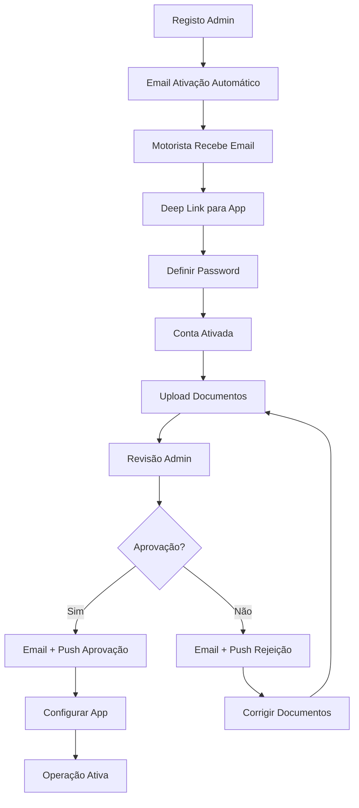

# 📚 Documentação Completa - Sistema de Entrega Deliver Eat Now

## 🎯 Visão Geral

Este documento centraliza toda a documentação técnica do sistema Deliver Eat Now, incluindo dashboards, componentes TSX, Edge Functions e fluxos completos implementados.

## 🚚 Fluxo Completo do Motorista

### 📋 Resumo do Fluxo

O sistema implementa um fluxo completo e automatizado para motoristas, desde o registo até à operação ativa:



### 🔄 Fases do Fluxo

#### 1. **Registo e Ativação**
- **Trigger**: Admin cria motorista no dashboard
- **Automático**: Email de ativação enviado via Brevo
- **Ação Motorista**: Clica no deep link e define password
- **Resultado**: Conta ativada automaticamente

#### 2. **Submissão de Documentos**
- **Ação Motorista**: Upload de documentos obrigatórios
- **Validação**: Verificação automática de formatos
- **Status**: Documentos ficam pendentes de aprovação

#### 3. **Revisão Administrativa**
- **Ação Admin**: Aprovação ou rejeição via dashboard
- **Automático**: Email + push notification enviados
- **Opções**: Aprovação direta ou rejeição com motivo

#### 4. **Configuração da App**
- **Ação Motorista**: Configurar preferências
- **Permissões**: Localização, notificações
- **Status**: Online/Offline

#### 5. **Operação Ativa**
- **Funcionalidades**: Receber entregas, navegação GPS
- **Notificações**: Push notifications em tempo real
- **Tracking**: Localização e status em tempo real

## 🖥️ Dashboards e Páginas Principais

### 📊 AdminDashboard.tsx
**Localização**: `src/pages/AdminDashboard.tsx`
**Rota**: `/admin`
**Roles**: `super_admin`, `platform_owner`

**Funcionalidades**:
- Estatísticas em tempo real
- Gestão de utilizadores
- Gestão de restaurantes
- Gestão de motoristas
- Filtros por organização

### 🏢 OrganizationDashboard.tsx
**Localização**: `src/pages/OrganizationDashboard.tsx`
**Rota**: `/organization/:id`
**Roles**: `super_admin`, `admin`

**Funcionalidades**:
- Métricas da organização
- Gestão de restaurantes
- Gestão de utilizadores
- Configurações específicas

### 🌐 OrganizationsPortal.tsx
**Localização**: `src/pages/OrganizationsPortal.tsx`
**Rota**: `/organizations`
**Roles**: `platform_owner`

**Funcionalidades**:
- Lista de organizações
- Criação de organizações
- Estatísticas globais

### 👤 CustomerDashboard.tsx
**Localização**: `src/pages/CustomerDashboard.tsx`
**Rota**: `/customer`
**Roles**: `customer`

**Funcionalidades**:
- Histórico de pedidos
- Perfil do cliente
- Endereços
- Métodos de pagamento

### 🍽️ RestaurantDashboard.tsx
**Localização**: `src/pages/RestaurantDashboard.tsx`
**Rota**: `/restaurant`
**Roles**: `restaurant_admin`, `restaurant_staff`

**Funcionalidades**:
- Gestão de pedidos
- Gestão de menu
- Estatísticas
- Configurações

### 👨‍🍳 KitchenDashboard.tsx
**Localização**: `src/pages/KitchenDashboard.tsx`
**Rota**: `/kitchen`
**Roles**: `kitchen_staff`

**Funcionalidades**:
- Pedidos em tempo real
- Status de preparação
- Tempos de entrega

### 🚚 DriverDashboard.tsx
**Localização**: `src/pages/DriverDashboard.tsx`
**Rota**: `/driver`
**Roles**: `driver`

**Funcionalidades**:
- Entregas ativas
- Histórico
- Estatísticas
- Mapa

### 💰 MonetizationManagement.tsx
**Localização**: `src/pages/MonetizationManagement.tsx`
**Rota**: `/monetization`
**Roles**: `platform_owner`, `super_admin`

**Funcionalidades**:
- Configuração de comissões
- Relatórios financeiros
- Análise de receitas

### 📚 HelpCenter.tsx
**Localização**: `src/pages/HelpCenter.tsx`
**Rota**: `/help-center`
**Roles**: `all`

**Funcionalidades**:
- Documentação completa
- Guias de uso
- FAQ
- Suporte técnico

### 📖 HelpDocumentation.tsx
**Localização**: `src/pages/HelpDocumentation.tsx`
**Rota**: `/help/docs`
**Roles**: `all`

**Funcionalidades**:
- Documentação técnica centralizada
- Lista de todos os componentes
- Pesquisa e filtros
- Links rápidos

## 🧩 Componentes Administrativos

### 🚚 DriverManagement.tsx
**Localização**: `src/components/admin/DriverManagement.tsx`

**Funcionalidades Implementadas**:
- ✅ Lista completa de motoristas
- ✅ Filtros por status (pendente, ativo, inativo)
- ✅ Pesquisa por nome, email, telefone
- ✅ **Aprovação de motoristas** (NOVO)
- ✅ **Rejeição com motivo** (NOVO)
- ✅ Reenvio de emails de ativação
- ✅ Indicadores visuais de status
- ✅ Dialog de confirmação para rejeições
- ✅ Loading states e feedback visual
- ✅ Integração com Edge Functions

**Estados Geridos**:
```typescript
const [drivers, setDrivers] = useState([])
const [isLoading, setIsLoading] = useState(true)
const [searchTerm, setSearchTerm] = useState('')
const [statusFilter, setStatusFilter] = useState('all')
const [isProcessingApproval, setIsProcessingApproval] = useState<string | null>(null)
const [rejectionDialog, setRejectionDialog] = useState({
  isOpen: false,
  driver: null,
  reason: '',
  isProcessing: false
})
```

**Funções Principais**:
- `fetchDrivers()`: Carrega lista de motoristas
- `approveDriver(driverId)`: Aprova motorista e envia notificações
- `rejectDriver(driverId, reason)`: Rejeita motorista com motivo
- `resendActivationEmail(driverId)`: Reenvia email de ativação

### 👥 UserManagementDialog.tsx
**Localização**: `src/components/admin/UserManagementDialog.tsx`

**Funcionalidades**:
- Criação de utilizadores
- Edição de perfis
- Gestão de roles
- Validação de dados

### 🔐 UserRoleManagement.tsx
**Localização**: `src/components/admin/UserRoleManagement.tsx`

**Funcionalidades**:
- Atribuição de roles
- Gestão de permissões
- Hierarquia de acesso

### 🏪 CreateRestaurantDialog.tsx
**Localização**: `src/components/admin/CreateRestaurantDialog.tsx`

**Funcionalidades**:
- Criação de restaurantes
- Upload de imagens
- Configuração inicial

### 🗺️ DeliveryAreasManager.tsx
**Localização**: `src/components/admin/DeliveryAreasManager.tsx`

**Funcionalidades**:
- Definição de áreas
- Mapas interativos
- Cálculo de distâncias

### 📋 MenuBuilder.tsx
**Localização**: `src/components/admin/MenuBuilder.tsx`

**Funcionalidades**:
- Editor visual
- Categorias
- Preços
- Imagens

### 🎨 MenuTemplatesGallery.tsx
**Localização**: `src/components/admin/MenuTemplatesGallery.tsx`

**Funcionalidades**:
- Templates prontos
- Clonagem de menus
- Personalização

## 📱 Componentes da App Driver

### 🔓 ActivationScreen.tsx
**Localização**: `Driver/src/screens/auth/ActivationScreen.tsx`

**Funcionalidades Implementadas**:
- ✅ **Deep linking automático**
- ✅ **Extração de token da URL**
- ✅ **Definição de password**
- ✅ **Ativação automática da conta**
- ✅ **Validação de token**
- ✅ **Feedback visual de sucesso/erro**
- ✅ **Redirecionamento automático**

**Fluxo de Ativação**:
1. Motorista clica no link do email
2. App abre automaticamente na tela de ativação
3. Token é extraído da URL
4. Motorista define password
5. Conta é ativada automaticamente
6. Redirecionamento para dashboard

### 🔑 LoginScreen.tsx
**Localização**: `Driver/src/screens/auth/LoginScreen.tsx`

**Funcionalidades**:
- Autenticação
- Validação
- Recuperação de password

### 🏠 HomeScreen.tsx
**Localização**: `Driver/src/screens/delivery/HomeScreen.tsx`

**Funcionalidades**:
- Lista de entregas
- Status online/offline
- Notificações

### 🚚 ActiveDeliveryScreen.tsx
**Localização**: `Driver/src/screens/delivery/ActiveDeliveryScreen.tsx`

**Funcionalidades**:
- Navegação GPS
- Status da entrega
- Comunicação com cliente

### 👤 ProfileScreen.tsx
**Localização**: `Driver/src/screens/profile/ProfileScreen.tsx`

**Funcionalidades**:
- Dados pessoais
- Estatísticas
- Configurações
- Documentos

### 📊 HistoryScreen.tsx
**Localização**: `Driver/src/screens/profile/HistoryScreen.tsx`

**Funcionalidades**:
- Lista de entregas
- Filtros
- Detalhes
- Ganhos

### 🗺️ MapScreen.tsx
**Localização**: `Driver/src/screens/delivery/MapScreen.tsx`

**Funcionalidades**:
- Mapa interativo
- Localização em tempo real
- Entregas próximas

### 📍 DeliveryTracking.tsx
**Localização**: `Driver/src/components/delivery/DeliveryTracking.tsx`

**Funcionalidades**:
- Tracking GPS
- Atualizações automáticas
- Status da entrega

## 🏗️ Componentes de Layout

### 📋 Header.tsx
**Localização**: `src/components/layout/Header.tsx`

**Funcionalidades**:
- Navegação
- Menu de utilizador
- Notificações

### 🔒 ProtectedRoute.tsx
**Localização**: `src/components/layout/ProtectedRoute.tsx`

**Funcionalidades**:
- Autenticação
- Autorização
- Redirecionamento

### 🧭 ScopeNavigationBar.tsx
**Localização**: `src/components/layout/ScopeNavigationBar.tsx`

**Funcionalidades**:
- Navegação contextual
- Filtros de scope
- Breadcrumbs

### 🍞 ViewScopeBreadcrumb.tsx
**Localização**: `src/components/layout/ViewScopeBreadcrumb.tsx`

**Funcionalidades**:
- Navegação hierárquica
- Contexto visual

## 💳 Componentes de Pagamento

### 💳 StripeCheckout.tsx
**Localização**: `src/components/payment/StripeCheckout.tsx`

**Funcionalidades**:
- Pagamentos por cartão
- Validação
- Segurança PCI

### 📱 MBWayPayment.tsx
**Localização**: `src/components/payment/MBWayPayment.tsx`

**Funcionalidades**:
- Integração MB Way
- Validação de número
- Confirmação automática

### 🏧 MultibancoPayment.tsx
**Localização**: `src/components/payment/MultibancoPayment.tsx`

**Funcionalidades**:
- Referência Multibanco
- QR Code
- Validação automática

## 📤 Componentes de Upload

### 🖼️ ImageUpload.tsx
**Localização**: `src/components/upload/ImageUpload.tsx`

**Funcionalidades**:
- Drag & drop
- Preview
- Compressão
- Validação

### 🍽️ MenuImageUpload.tsx
**Localização**: `src/components/upload/MenuImageUpload.tsx`

**Funcionalidades**:
- Upload otimizado
- Redimensionamento
- Formatos múltiplos

## 🏪 Componentes de Restaurante

### 🏪 RestaurantCard.tsx
**Localização**: `src/components/home/RestaurantCard.tsx`

**Funcionalidades**:
- Informações do restaurante
- Avaliações
- Tempo de entrega

### ⭐ PopularRestaurants.tsx
**Localização**: `src/components/home/PopularRestaurants.tsx`

**Funcionalidades**:
- Lista de populares
- Filtros
- Ordenação

### 🏷️ Categories.tsx
**Localização**: `src/components/home/Categories.tsx`

**Funcionalidades**:
- Grid de categorias
- Ícones
- Navegação

## ⚡ Edge Functions (Backend)

### 📧 send-driver-activation
**Localização**: `supabase/functions/send-driver-activation/index.ts`

**Funcionalidades Implementadas**:
- ✅ **Trigger automático** quando motorista é criado
- ✅ **Email HTML personalizado** via Brevo
- ✅ **Deep linking** para ativação na app
- ✅ **Template responsivo** com branding
- ✅ **Gestão de erros** e logs
- ✅ **Validação de dados** de entrada

**Trigger SQL**:
```sql
CREATE OR REPLACE FUNCTION trigger_send_driver_activation()
RETURNS TRIGGER AS $$
BEGIN
  -- Enviar email de ativação automaticamente
  PERFORM net.http_post(
    url := 'https://your-project.supabase.co/functions/v1/send-driver-activation',
    headers := '{"Content-Type": "application/json", "Authorization": "Bearer ' || 'your-anon-key' || '"}',
    body := json_build_object(
      'driverId', NEW.id,
      'email', NEW.email,
      'firstName', NEW.first_name,
      'activationToken', NEW.activation_token
    )::text
  );
  RETURN NEW;
END;
$$ LANGUAGE plpgsql;
```

### 📬 notify-driver-status
**Localização**: `supabase/functions/notify-driver-status/index.ts`

**Funcionalidades Implementadas**:
- ✅ **Notificação de aprovação** com email HTML
- ✅ **Notificação de rejeição** com motivo opcional
- ✅ **Push notifications** automáticas
- ✅ **Templates distintos** para cada status
- ✅ **Integração com Brevo** para emails
- ✅ **Chamada automática** da função de push

**Tipos de Notificação**:
```typescript
type NotificationStatus = 'approved' | 'rejected'

interface NotificationRequest {
  driverId: string
  status: NotificationStatus
  rejectionReason?: string
}
```

**Templates de Email**:
- **Aprovação**: Email de boas-vindas com instruções
- **Rejeição**: Email explicativo com motivo e próximos passos

### 📱 send-push-notification
**Localização**: `supabase/functions/send-push-notification/index.ts`

**Funcionalidades Implementadas**:
- ✅ **Gestão de tokens push** ativos
- ✅ **Integração com Expo Push API**
- ✅ **Log de notificações** enviadas
- ✅ **Desativação de tokens inválidos**
- ✅ **Suporte para múltiplos motoristas**
- ✅ **Tipos de notificação** específicos

**Tipos de Push Notification**:
```typescript
type NotificationType = 
  | 'new_delivery' 
  | 'delivery_update' 
  | 'account_approved' 
  | 'account_rejected' 
  | 'general'
```

**Estrutura da Tabela de Log**:
```sql
CREATE TABLE push_notifications_log (
  id UUID PRIMARY KEY DEFAULT gen_random_uuid(),
  driver_id UUID REFERENCES drivers(id),
  title TEXT NOT NULL,
  body TEXT NOT NULL,
  type TEXT NOT NULL,
  success_count INTEGER DEFAULT 0,
  error_count INTEGER DEFAULT 0,
  created_at TIMESTAMP WITH TIME ZONE DEFAULT NOW()
);
```

## 🗄️ Migrações de Base de Dados

### 📊 push_notifications_log
**Localização**: `supabase/migrations/20241220_create_push_notifications_log.sql`

**Funcionalidades**:
- Tabela para log de notificações push
- Índices para performance
- RLS policies para segurança
- Campos para estatísticas de sucesso/erro

## 📧 Templates de Email

### ✅ Email de Aprovação
**Características**:
- Design responsivo
- Branding consistente
- Call-to-action claro
- Instruções de próximos passos

### ❌ Email de Rejeição
**Características**:
- Tom empático e construtivo
- Motivo específico da rejeição
- Instruções para correção
- Contacto de suporte

### 🔓 Email de Ativação
**Características**:
- Deep link para app
- Instruções claras
- Design mobile-first
- Expiração do token

## 📱 Push Notifications

### 🔔 Tipos Implementados
- `account_approved`: Conta aprovada
- `account_rejected`: Conta rejeitada
- `new_delivery`: Nova entrega disponível
- `general`: Notificações gerais

### 🎯 Funcionalidades
- Tokens múltiplos por motorista
- Desativação automática de tokens inválidos
- Log completo de envios
- Integração com Expo

## 🔧 Configurações Técnicas

### 🌐 URLs e Endpoints
- **Web App**: `http://localhost:8081/`
- **Documentação**: `http://localhost:8081/help/docs`
- **Admin Dashboard**: `http://localhost:8081/admin`
- **API Supabase**: Configurado via variáveis de ambiente

### 🔑 Variáveis de Ambiente
```env
VITE_SUPABASE_URL=your-supabase-url
VITE_SUPABASE_ANON_KEY=your-anon-key
BREVO_API_KEY=your-brevo-key
EXPO_ACCESS_TOKEN=your-expo-token
```

### 📦 Dependências Principais
- **React 18** com TypeScript
- **Supabase** para backend
- **React Router** para navegação
- **Tailwind CSS** para styling
- **Lucide React** para ícones
- **React Query** para data fetching

## 📈 Métricas e Monitorização

### 📊 Dashboards Disponíveis
- Estatísticas de motoristas
- Taxa de aprovação/rejeição
- Tempo médio de ativação
- Notificações enviadas

### 🔍 Logs e Debugging
- Logs de Edge Functions
- Histórico de emails enviados
- Log de push notifications
- Erros de ativação

## 🚀 Estado Atual do Sistema

### ✅ Funcionalidades Completas
- [x] Registo automático de motoristas
- [x] Email de ativação com deep linking
- [x] Ativação via app mobile
- [x] Upload e gestão de documentos
- [x] Aprovação/rejeição administrativa
- [x] Notificações email + push
- [x] Dashboard administrativo completo
- [x] App mobile funcional
- [x] Sistema de logs e monitorização

### 🎯 Próximos Passos
- [ ] Testes automatizados
- [ ] Monitorização avançada
- [ ] Otimizações de performance
- [ ] Documentação de API

## 📞 Suporte e Contactos

Para questões técnicas ou suporte:
- **Documentação**: `/help/docs`
- **Centro de Ajuda**: `/help-center`
- **Dashboard Admin**: `/admin`

---

**Última Atualização**: 20 de Dezembro de 2024
**Versão**: 1.0.0
**Status**: ✅ Produção Ready