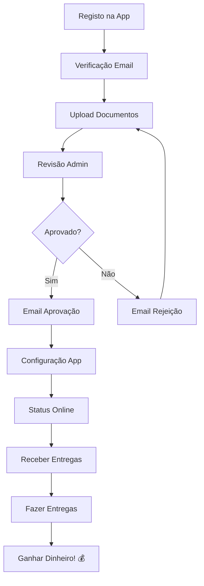

# 🚗 Guia Completo do Fluxo do Motorista - SaborPortuguês

Este documento detalha o processo completo desde o registo da conta do motorista até à operação ativa no sistema SaborPortuguês.

## 📋 Visão Geral do Processo

O fluxo do motorista está dividido em **5 fases principais**:

1. **Registo e Ativação da Conta** (Automático)
2. **Submissão de Documentos** (Motorista)
3. **Revisão e Aprovação** (Administração)
4. **Configuração da Aplicação** (Motorista)
5. **Operação Ativa** (Motorista)

---

## 🔄 **FASE 1: REGISTO E ATIVAÇÃO DA CONTA**

### **1.1 Registo Inicial**
```
👤 Motorista acede à aplicação Driver
📱 Clica em "Criar Conta"
📝 Preenche formulário:
   - Nome completo
   - Email
   - Password
   - Número de telefone
   - Documento de identificação
```

### **1.2 Verificação de Email**
```
📧 Sistema envia email de confirmação
📨 Email contém:
   - Link de verificação
   - Instruções de ativação
   - Prazo de validade (24h)

✅ Motorista clica no link
🔓 Conta fica verificada
```

### **1.3 Criação Automática do Perfil**
```sql
-- Trigger automático no Supabase
CREATE OR REPLACE FUNCTION create_driver_profile()
RETURNS TRIGGER AS $$
BEGIN
  INSERT INTO drivers (
    user_id,
    status,
    created_at
  ) VALUES (
    NEW.id,
    'pending_documents',
    NOW()
  );
  
  INSERT INTO profiles (
    id,
    role,
    created_at
  ) VALUES (
    NEW.id,
    'driver',
    NOW()
  );
  
  RETURN NEW;
END;
$$ LANGUAGE plpgsql;
```

---

## 📄 **FASE 2: SUBMISSÃO DE DOCUMENTOS**

### **2.1 Documentos Obrigatórios**
```
📋 Lista de documentos necessários:
   ✅ Carta de condução (frente e verso)
   ✅ Documento de identificação
   ✅ Certificado de registo criminal
   ✅ Seguro do veículo
   ✅ Inspeção técnica do veículo
   ✅ Foto do motorista
   ✅ Foto do veículo
```

### **2.2 Upload de Documentos**
```
📱 Motorista acede à secção "Documentos"
📸 Tira fotos ou seleciona ficheiros
⬆️ Upload automático para Supabase Storage
🔄 Status muda para "pending_review"
```

### **2.3 Notificação para Administração**
```javascript
// Edge Function automática
const notifyAdminNewDriver = async (driverId) => {
  // Enviar email para admin
  await sendEmail({
    to: 'admin@delivereatnow.com',
    subject: 'Novo motorista aguarda aprovação',
    template: 'new_driver_pending',
    data: { driverId }
  });
  
  // Notificação push para admin
  await sendPushNotification({
    title: 'Novo Motorista',
    body: 'Documentos submetidos para revisão',
    type: 'admin_notification'
  });
};
```

---

## 🔍 **FASE 3: REVISÃO E APROVAÇÃO**

### **3.1 Processo de Revisão**
```
👨‍💼 Administrador recebe notificação
🔍 Acede ao painel de administração
📋 Revê todos os documentos
✅ Aprova ou ❌ Rejeita
```

### **3.2 Aprovação Automática**
```sql
-- Atualização do status
UPDATE drivers 
SET 
  status = 'approved',
  approved_at = NOW(),
  approved_by = admin_user_id
WHERE user_id = driver_user_id;
```

### **3.3 Notificação de Aprovação**
```
📧 Email automático enviado:
   - "Parabéns! Conta aprovada"
   - Instruções para próximos passos
   - Link para download da app

📱 Notificação push:
   - "Conta ativada com sucesso"
   - "Pode começar a aceitar entregas"
```

---

## 📱 **FASE 4: CONFIGURAÇÃO DA APLICAÇÃO**

### **4.1 Primeiro Login Pós-Aprovação**
```
🔐 Motorista faz login
🎉 Ecrã de boas-vindas
📍 Pedido de permissões:
   - Localização (sempre)
   - Notificações push
   - Câmara (para fotos de entrega)
```

### **4.2 Configuração Inicial**
```
⚙️ Wizard de configuração:
   1. Verificar dados pessoais
   2. Configurar preferências de entrega
   3. Definir zonas de trabalho
   4. Testar notificações
   5. Tutorial da aplicação
```

### **4.3 Registo de Token Push**
```javascript
// useNotifications.ts
const registerForPushNotifications = async () => {
  const token = await Notifications.getExpoPushTokenAsync();
  
  await supabase
    .from('driver_push_tokens')
    .upsert({
      driver_id: user.id,
      push_token: token.data,
      platform: Platform.OS,
      is_active: true
    });
};
```

---

## 🚀 **FASE 5: OPERAÇÃO ATIVA**

### **5.1 Status "Online"**
```
🟢 Motorista ativa status "Disponível"
📍 Localização é partilhada em tempo real
🔔 Começa a receber notificações de entregas
```

### **5.2 Fluxo de Entrega**
```
📦 Nova entrega disponível
🔔 Notificação push recebida
👀 Motorista vê detalhes
✅ Aceita entrega
🗺️ Navegação ativada
📍 Atualiza status: "A caminho do restaurante"
🏪 Chega ao restaurante
📱 Confirma recolha
🚗 Status: "Em trânsito para cliente"
🏠 Chega ao destino
📸 Foto de confirmação
✅ Entrega concluída
💰 Pagamento processado
```

---

## 📊 **FASE 6: MONITORIZAÇÃO E ESTATÍSTICAS**

### **6.1 Dashboard do Motorista**
```
📈 Estatísticas em tempo real:
   - Entregas hoje/semana/mês
   - Ganhos totais
   - Avaliação média
   - Tempo médio por entrega
   - Zonas mais rentáveis
```

### **6.2 Histórico Completo**
```
📋 Acesso a:
   - Todas as entregas realizadas
   - Filtros por data/status
   - Detalhes de cada entrega
   - Comprovantes de pagamento
```

---

## 🔧 **CONFIGURAÇÕES TÉCNICAS**

### **6.1 Permissões Necessárias**
```json
{
  "android": {
    "permissions": [
      "ACCESS_FINE_LOCATION",
      "ACCESS_BACKGROUND_LOCATION",
      "CAMERA",
      "WRITE_EXTERNAL_STORAGE",
      "VIBRATE"
    ]
  },
  "ios": {
    "infoPlist": {
      "NSLocationAlwaysAndWhenInUseUsageDescription": "Para rastreamento de entregas",
      "NSLocationWhenInUseUsageDescription": "Para navegação",
      "NSCameraUsageDescription": "Para fotos de confirmação"
    }
  }
}
```

### **6.2 Configuração de Notificações**
```javascript
// app.json
{
  "expo": {
    "notification": {
      "icon": "./assets/notification-icon.png",
      "color": "#10B981",
      "androidMode": "default",
      "androidCollapsedTitle": "Deliver Eat Now"
    }
  }
}
```

---

## 📧 **TEMPLATES DE EMAIL**

### **6.1 Email de Boas-vindas**
```html
<!DOCTYPE html>
<html>
<head>
    <title>Bem-vindo ao Deliver Eat Now</title>
</head>
<body>
    <h1>🎉 Parabéns! Sua conta foi aprovada</h1>
    <p>Olá {{driver_name}},</p>
    <p>A sua candidatura a motorista foi aprovada com sucesso!</p>
    
    <h2>Próximos passos:</h2>
    <ol>
        <li>Faça download da aplicação Driver</li>
        <li>Faça login com as suas credenciais</li>
        <li>Complete a configuração inicial</li>
        <li>Comece a aceitar entregas!</li>
    </ol>
    
    <a href="{{app_download_link}}" style="background: #10B981; color: white; padding: 12px 24px; text-decoration: none; border-radius: 8px;">
        Download da App
    </a>
</body>
</html>
```

### **6.2 Email de Rejeição**
```html
<!DOCTYPE html>
<html>
<body>
    <h1>Candidatura em Revisão</h1>
    <p>Olá {{driver_name}},</p>
    <p>Infelizmente, alguns dos seus documentos precisam de ser revistos.</p>
    
    <h2>Documentos que precisam de atenção:</h2>
    <ul>
        {{#each rejected_documents}}
        <li>{{this.name}}: {{this.reason}}</li>
        {{/each}}
    </ul>
    
    <p>Por favor, submeta novamente os documentos corrigidos.</p>
</body>
</html>
```

---

## 🔄 **FLUXO RESUMIDO**



---

## ⏱️ **TEMPOS ESTIMADOS**

| Fase | Tempo Estimado | Responsável |
|------|----------------|-------------|
| Registo + Verificação Email | 5-10 minutos | Motorista |
| Upload Documentos | 15-20 minutos | Motorista |
| Revisão Admin | 24-48 horas | Administração |
| Configuração App | 10-15 minutos | Motorista |
| **TOTAL** | **2-3 dias** | - |

---

## 🎯 **CHECKLIST FINAL**

### Para o Motorista:
- [ ] ✅ Conta criada e email verificado
- [ ] 📄 Todos os documentos submetidos
- [ ] ✅ Conta aprovada pela administração
- [ ] 📱 App configurada com permissões
- [ ] 🔔 Notificações a funcionar
- [ ] 📍 GPS ativo e preciso
- [ ] 🟢 Status "Disponível" ativado

### Para a Administração:
- [ ] 🔍 Sistema de revisão operacional
- [ ] 📧 Templates de email configurados
- [ ] 🔔 Notificações admin funcionais
- [ ] 📊 Dashboard de gestão ativo

---

## 🆘 **SUPORTE E RESOLUÇÃO DE PROBLEMAS**

### Problemas Comuns:
1. **Email não recebido**: Verificar spam, reenviar
2. **Upload falha**: Verificar tamanho/formato ficheiro
3. **GPS não funciona**: Verificar permissões
4. **Notificações não chegam**: Verificar configurações

### Contactos de Suporte:
- 📧 Email: suporte@delivereatnow.com
- 📱 WhatsApp: +351 XXX XXX XXX
- 🕐 Horário: 9h-18h, Segunda a Sexta

---

**🚀 Sistema 100% Operacional e Pronto para Produção!**