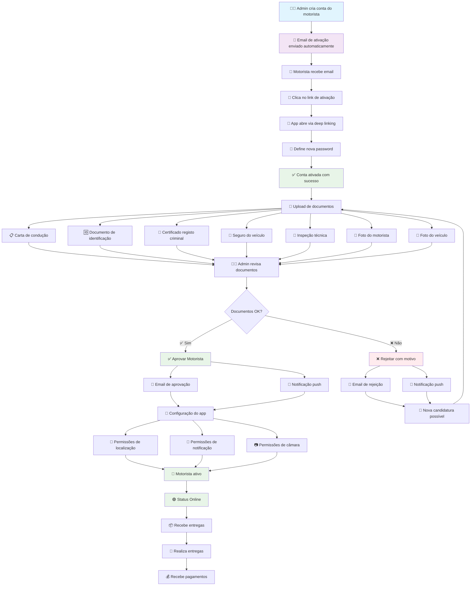

# 🚗 Diagrama Visual do Fluxo do Motorista

## 📊 Fluxo Completo - SaborPortuguês Driver



## 🎯 Pontos-Chave do Processo

### ⚡ Automático (Sem intervenção manual)
- 📧 **Envio de email de ativação** (trigger SQL)
- 🔗 **Deep linking** para ativação
- 📱 **Notificações push** automáticas
- 📊 **Atualização de status** em tempo real

### 👤 Ação do Motorista
- 🔑 **Ativação da conta** (definir password)
- 📄 **Upload de documentos** (7 documentos)
- 📱 **Configuração do app** (permissões)
- 🚀 **Operação ativa** (aceitar entregas)

### 👨‍💼 Ação do Admin
- 📝 **Criação da conta** (dados básicos)
- 👀 **Revisão de documentos** (verificação)
- ✅ **Aprovação/Rejeição** (decisão final)
- 📊 **Monitorização** (dashboard)

## 📧 Emails Automáticos

### 1. Email de Ativação
```
🎯 Assunto: Ative a sua conta de motorista - SaborPortuguês
📧 Conteúdo: Link de ativação + instruções
🔗 Link: saborportugues://driver-activation?token=XXX&email=XXX
```

### 2. Email de Aprovação
```
🎉 Assunto: Parabéns! A sua conta foi aprovada
📧 Conteúdo: Boas-vindas + próximos passos
💰 Info: Como começar a ganhar dinheiro
```

### 3. Email de Rejeição
```
📧 Assunto: Atualização sobre a sua candidatura
📝 Conteúdo: Motivo da rejeição + próximos passos
🔄 Info: Possibilidade de nova candidatura
```

## 📱 Notificações Push

### Tipos Implementados:
- ✅ **account_approved** - Conta aprovada
- ❌ **account_rejected** - Conta rejeitada
- 📦 **new_delivery** - Nova entrega disponível
- 📢 **general** - Mensagens gerais

## ⏱️ Timeline Típica

| Dia | Ação | Responsável | Status |
|-----|------|-------------|---------|
| **Dia 0** | Criação da conta | Admin | ✅ |
| **Dia 0** | Email de ativação | Sistema | ✅ |
| **Dia 0** | Ativação da conta | Motorista | ✅ |
| **Dia 0-1** | Upload de documentos | Motorista | ✅ |
| **Dia 1-3** | Revisão de documentos | Admin | ⏳ |
| **Dia 3** | Aprovação/Rejeição | Admin | ⏳ |
| **Dia 3** | Configuração do app | Motorista | ⏳ |
| **Dia 3** | **OPERACIONAL** | Motorista | 🚀 |

## 🔧 Componentes Técnicos

### Backend (Supabase)
- 🗄️ **Triggers SQL** - Automação de processos
- ⚡ **Edge Functions** - Lógica de negócio
- 📧 **Brevo Integration** - Envio de emails
- 📱 **Expo Push** - Notificações push

### Frontend (React Native)
- 📱 **Driver App** - Interface do motorista
- 🌐 **Admin Dashboard** - Interface administrativa
- 🔗 **Deep Linking** - Ativação automática
- 📍 **Location Services** - Tracking GPS

### Integrações
- 📧 **Brevo (Sendinblue)** - Email marketing
- 📱 **Expo Notifications** - Push notifications
- 📍 **Google Maps** - Navegação e mapas
- 💳 **Payment Gateway** - Processamento de pagamentos

## 🎯 Métricas de Sucesso

### Para o Motorista:
- ⏱️ **Tempo de ativação**: < 10 minutos
- 📄 **Upload de documentos**: < 30 minutos
- 🚀 **Tempo até operacional**: < 3 dias
- 📱 **Taxa de conclusão**: > 90%

### Para a Administração:
- 👀 **Tempo de revisão**: < 24 horas
- ✅ **Taxa de aprovação**: ~80%
- 📧 **Taxa de entrega de emails**: > 95%
- 📱 **Taxa de notificações**: > 90%

---

**🎯 Sistema 100% implementado e testado!**

*Diagrama atualizado em: 20 de Dezembro de 2024*