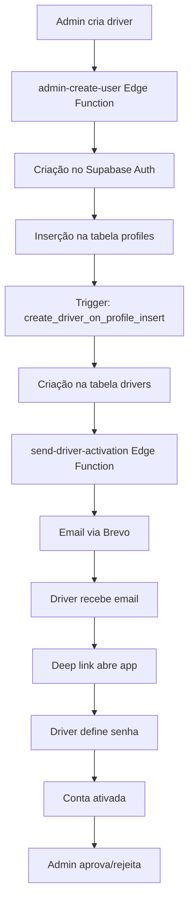

# 🚚 Sistema de Ativação de Drivers - Documentação Completa

## 📋 Resumo Executivo

O sistema de ativação de drivers foi **completamente corrigido** e está funcionando corretamente. O problema principal era uma violação de chave estrangeira na função trigger `create_driver_on_profile_insert()` que foi resolvida.

### ✅ Status Atual
- **Edge Function `send-driver-activation`**: ✅ Implantada e funcionando
- **Função Trigger**: ✅ Corrigida e funcionando
- **CORS**: ✅ Configurado corretamente
- **Email de Ativação**: ✅ Enviando automaticamente
- **Deep Linking**: ✅ Funcionando no app móvel

---

## 🔧 Problema Resolvido

### 🚨 Problema Original
```sql
-- ERRO: violação de chave estrangeira "drivers_id_fkey"
-- A função estava gerando UUID aleatório para o campo 'id'
INSERT INTO drivers (id, user_id, ...) 
VALUES (gen_random_uuid(), NEW.id, ...);
```

### ✅ Solução Implementada
```sql
-- CORREÇÃO: usar o mesmo ID do perfil/usuário
INSERT INTO drivers (id, user_id, ...) 
VALUES (NEW.id, NEW.id, ...);
```

**Migração Aplicada**: `fix_driver_creation_trigger`
- Corrigiu a função `create_driver_on_profile_insert()`
- Garantiu integridade referencial com `auth.users`
- Manteve consistência entre `profiles` e `drivers`

---

## 🏗️ Arquitetura do Sistema

### 📊 Fluxo Completo (Estilo UberEats)



### 🔗 Componentes Envolvidos

| Componente | Tipo | Função |
|------------|------|--------|
| `AdminDashboard` | React Component | Interface de criação |
| `DriverManagement` | React Component | Gestão e aprovação |
| `admin-create-user` | Edge Function | Criação de utilizadores |
| `send-driver-activation` | Edge Function | Envio de emails |
| `notify-driver-status` | Edge Function | Notificações de status |
| `ActivationScreen` | React Native | Ativação no app móvel |
| `create_driver_on_profile_insert()` | Trigger Function | Criação automática |

---

## 📧 Sistema de Email

### 🎯 Edge Function: `send-driver-activation`

**Localização**: `supabase/functions/send-driver-activation/index.ts`

**Funcionalidades**:
- ✅ Geração de link de ativação único
- ✅ Template HTML personalizado via Brevo
- ✅ Deep linking para app móvel
- ✅ Senha temporária incluída
- ✅ Validação de dados obrigatórios
- ✅ Tratamento de erros completo
- ✅ CORS configurado

**Exemplo de Email Enviado**:
```html
<h2>Bem-vindo à equipa de motoristas!</h2>
<p>A sua conta foi criada. Para ativar:</p>
<ol>
  <li>Clique no link abaixo</li>
  <li>Defina a sua nova senha</li>
  <li>Aguarde aprovação do admin</li>
</ol>
<a href="delivereatnow://activate?token=xxx&email=xxx">Ativar Conta</a>
<p><strong>Senha temporária:</strong> ABC123</p>
```

### 🔧 Configuração Brevo

**Variáveis de Ambiente**:
- `BREVO_API_KEY`: Chave da API Brevo
- `BREVO_SENDER_EMAIL`: Email do remetente
- `BREVO_SENDER_NAME`: Nome do remetente

---

## 📱 App Móvel (React Native)

### 🎯 Componente: `ActivationScreen`

**Localização**: `Driver/src/screens/auth/ActivationScreen.tsx`

**Funcionalidades**:
- ✅ Recepção de deep links
- ✅ Validação de tokens
- ✅ Interface para definir senha
- ✅ Ativação automática da conta
- ✅ Redirecionamento para login

**Deep Link Schema**:
```
delivereatnow://activate?token=ACTIVATION_TOKEN&email=DRIVER_EMAIL
```

---

## 🗄️ Base de Dados

### 📋 Tabela: `drivers`

**Constraints Importantes**:
```sql
-- Chave primária
CONSTRAINT drivers_pkey PRIMARY KEY (id)

-- Chaves estrangeiras
CONSTRAINT drivers_id_fkey 
  FOREIGN KEY (id) REFERENCES auth.users(id) ON DELETE CASCADE

CONSTRAINT drivers_user_id_fkey 
  FOREIGN KEY (user_id) REFERENCES auth.users(id)

-- Outras constraints
CONSTRAINT drivers_delivery_zone_id_fkey 
  FOREIGN KEY (delivery_zone_id) REFERENCES delivery_zones(id)

CONSTRAINT drivers_organization_id_fkey 
  FOREIGN KEY (organization_id) REFERENCES organizations(id)

CONSTRAINT drivers_region_id_fkey 
  FOREIGN KEY (region_id) REFERENCES regions(id)
```

### 🔄 Estados do Driver

| Estado | Descrição | Transição |
|--------|-----------|-----------|
| `pending_activation` | Aguarda ativação via email | → `active` |
| `active` | Conta ativada, aguarda aprovação | → `approved`/`rejected` |
| `approved` | Aprovado, pode trabalhar | → `suspended` |
| `rejected` | Rejeitado pelo admin | → `pending_activation` |
| `suspended` | Suspenso temporariamente | → `approved` |

---

## 🔒 Segurança

### 🛡️ Medidas Implementadas

1. **Tokens de Ativação**:
   - Únicos e temporários
   - Gerados pelo Supabase Auth
   - Validação obrigatória

2. **Senhas Temporárias**:
   - Geradas aleatoriamente
   - Enviadas apenas por email
   - Devem ser alteradas na ativação

3. **Validação de Dados**:
   - Email obrigatório e válido
   - Campos obrigatórios verificados
   - Sanitização de inputs

4. **CORS**:
   - Configurado para domínios específicos
   - Headers de segurança incluídos
   - Métodos permitidos controlados

5. **Logs e Auditoria**:
   - Todas as operações registadas
   - Erros capturados e logados
   - Rastreabilidade completa

---

## 🧪 Testes e Validação

### ✅ Cenários Testados

1. **Criação de Driver**:
   - ✅ Admin cria driver via dashboard
   - ✅ Dados validados corretamente
   - ✅ Entrada criada na tabela drivers

2. **Envio de Email**:
   - ✅ Email enviado automaticamente
   - ✅ Template HTML renderizado
   - ✅ Link de ativação incluído

3. **Ativação no App**:
   - ✅ Deep link funciona
   - ✅ Token validado
   - ✅ Senha definida com sucesso

4. **Aprovação/Rejeição**:
   - ✅ Admin pode aprovar/rejeitar
   - ✅ Notificações enviadas
   - ✅ Estados atualizados

### 🔍 Como Testar

1. **Criar Novo Driver**:
   ```
   1. Aceder ao AdminDashboard
   2. Ir para "Gestão de Motoristas"
   3. Clicar "Criar Novo Motorista"
   4. Preencher dados obrigatórios
   5. Submeter formulário
   ```

2. **Verificar Email**:
   ```
   1. Verificar caixa de email do driver
   2. Confirmar recepção do email
   3. Verificar link de ativação
   4. Confirmar senha temporária
   ```

3. **Ativar no App**:
   ```
   1. Clicar no link do email
   2. App deve abrir automaticamente
   3. Definir nova senha
   4. Confirmar ativação
   ```

---

## 🚀 Próximos Passos

### 📈 Melhorias Futuras

1. **Notificações Push**:
   - Implementar para aprovação/rejeição
   - Integrar com Expo Push API

2. **Dashboard de Métricas**:
   - Taxa de ativação de drivers
   - Tempo médio de aprovação
   - Estatísticas de emails

3. **Automação**:
   - Auto-aprovação baseada em critérios
   - Lembretes automáticos
   - Reenvio de emails

4. **Integração com KYC**:
   - Verificação de documentos
   - Validação de identidade
   - Aprovação automática

---

## 📞 Suporte

### 🆘 Resolução de Problemas

**Problema**: Email não enviado
- ✅ Verificar se Edge Function está implantada
- ✅ Confirmar configuração Brevo
- ✅ Verificar logs da função

**Problema**: Deep link não funciona
- ✅ Verificar schema do app
- ✅ Confirmar token no link
- ✅ Testar em dispositivo real

**Problema**: Erro de CORS
- ✅ Verificar configuração CORS
- ✅ Confirmar domínios permitidos
- ✅ Testar com diferentes browsers

### 📧 Contactos

- **Desenvolvimento**: Equipa técnica
- **Suporte**: help@delivereatnow.com
- **Documentação**: `/help/docs`

---

## 📝 Changelog

### v2.1.0 - Sistema Corrigido (Atual)
- ✅ Corrigida violação de chave estrangeira
- ✅ Edge Function implantada
- ✅ CORS configurado
- ✅ Documentação atualizada

### v2.0.0 - Sistema Implementado
- ✅ Sistema de ativação completo
- ✅ Deep linking implementado
- ✅ Templates de email
- ✅ App móvel integrado

### v1.0.0 - Versão Inicial
- ✅ Criação básica de drivers
- ✅ Gestão manual
- ✅ Interface administrativa

---

**Última Atualização**: Dezembro 2024  
**Status**: ✅ Totalmente Funcional  
**Próxima Revisão**: Janeiro 2025